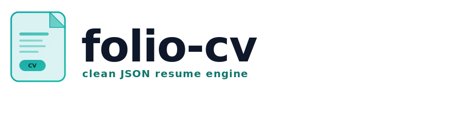
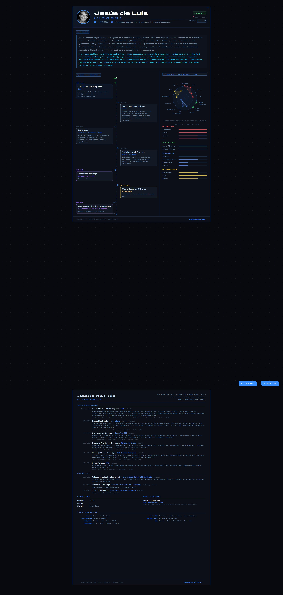
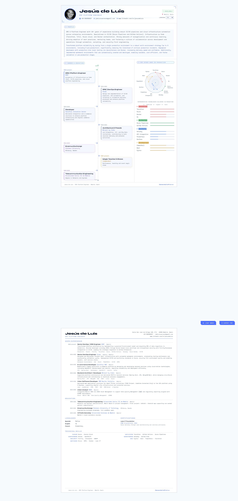

# Jesus de Luis - CV System

A data-driven CV that feels like a product, not a static document.

<picture>
  <source media="(prefers-color-scheme: dark)" srcset="assets/images/folio-cv-logo-alt-dark.svg">
  <source media="(prefers-color-scheme: light)" srcset="assets/images/folio-cv-logo-alt-light.svg">
  
</picture>

This project renders a bilingual CV from JSON, then compiles everything into a single deploy-ready HTML file for GitHub Pages.

## Preview

Dark mode and light mode side by side:

| Dark | Light |
|---|---|
|  |  |

## Live CV

Add your public URL here:

- `https://<username>.github.io/<repository>/`

For this repository, that is typically:

- `https://txitxo0.github.io/folio-cv/`

Note on auto-filling in README:

The workflow variable `${{ steps.deployment.outputs.page_url }}` only exists at runtime in GitHub Actions and cannot dynamically rewrite `README.md` on GitHub UI. For a stable README, keep this URL manually maintained.

## Why This Exists

Instead of maintaining CV text in multiple documents, the source of truth is one JSON contract:

1. Easy to edit and version.
2. Easy to localize (`en`, `es`, future locales).
3. Strictly validated through JSON Schema.
4. Consistent output across local and CI builds.

## Project Map

```text
index.html
build.py
requirements.txt
README.md
assets/
  css/
    cv.css
  js/
    cv.js
  data/
    cv-data.json
    cv-schema.json
  images/
    photo.jpg
dist/
  index.html
```

## Fast Start

Install dependencies:

```powershell
python -m pip install -r requirements.txt
```

Run in development mode:

```powershell
python -m http.server 8080
```

Open:

- `http://localhost:8080`

Build standalone output:

```powershell
python build.py
```

Build artifact:

- `dist/index.html`

Preview compiled artifact:

```powershell
cd dist
python -m http.server 8081
```

Open:

- `http://localhost:8081`

## Rendering Pipeline

1. `index.html` provides structure.
2. `assets/js/cv.js` reads `assets/data/cv-data.json`.
3. JSON drives header, summary, timeline, skills, formal page, and footer.
4. `build.py` validates JSON against `assets/data/cv-schema.json`.
5. `build.py` inlines CSS, JS, JSON, favicon, and local photo into one HTML file.

## Data Contract

Primary data source:

- `assets/data/cv-data.json`

Validation schema:

- `assets/data/cv-schema.json`

The root is multilingual:

```json
{
  "$schema": "./cv-schema.json",
  "cv": {
    "en": { "...": "locale data" },
    "es": { "...": "locale data" }
  }
}
```

Locale keys support `xx` and `xx-YY` (for example `en`, `es`, `en-US`).

Each locale requires these sections:

1. `meta`
2. `ui`
3. `personal`
4. `experience`
5. `skills`
6. `formal`

## JSON Reference

### `meta`

Used by footer and versioning.

| Property | Type | Required | Description |
|---|---|---|---|
| `lastUpdated` | string | yes | Last update label (year or date). |
| `version` | string | yes | Human-readable data version. |
| `branding` | string | yes | Footer brand text. |

### `ui`

All locale-specific labels used by the UI.

| Property | Type | Required |
|---|---|---|
| `langLabel` | string | yes |
| `tagProfile` | string | yes |
| `tagCareer` | string | yes |
| `tagStack` | string | yes |
| `timelineNow` | string | yes |
| `timelinePast` | string | yes |
| `available` | string | yes |
| `stackNote` | string | yes |
| `updatedPrefix` | string | yes |
| `btnTheme` | string | yes |
| `btnPrint` | string | yes |
| `fWorkExp` | string | yes |
| `fEducation` | string | yes |
| `fLanguages` | string | yes |
| `fCertifications` | string | yes |
| `fTechSkills` | string | yes |

### `personal`

Header and summary content.

| Property | Type | Required | Description |
|---|---|---|---|
| `name` | string | yes | Full name. |
| `title` | string | yes | Professional headline. |
| `photo` | string | yes | Relative path or URL. |
| `location` | string | yes | Location label. |
| `contact` | object | yes | Contact info block. |
| `summary` | string | yes | Main summary paragraph. |
| `summaryImpact` | string | yes | Secondary impact paragraph. |
| `summaryImpactEnabled` | boolean | no | Toggle for `summaryImpact`. |

`contact` object:

| Property | Type | Required |
|---|---|---|
| `phone` | string | yes |
| `email` | string | yes |
| `linkedin` | string | yes |
| `linkedinUrl` | string (URI) | yes |

### `experience[]`

Visual timeline cards on page 1.

| Property | Type | Required | Notes |
|---|---|---|---|
| `id` | string | yes | Stable id. |
| `period` | string | yes | Date range. |
| `company` | string | yes | Company or institution. |
| `role` | string | yes | Role title. |
| `description` | string | yes | Supporting text. |
| `type` | string | yes | `work`, `education`, `other`. |
| `highlight` | boolean | yes | Featured styling. |
| `enabled` | boolean | no | Visibility toggle. |

### `skills`

Data for bars and radar.

`skills.levels`:

- object map with numeric string keys (`"1"`, `"2"`, `"3"`) and label values.

`skills.categories[]`:

| Property | Type | Required | Notes |
|---|---|---|---|
| `name` | string | yes | Category title. |
| `color` | string | yes | Hex color `#RRGGBB`. |
| `pastelColor` | string | no | Optional visual override. |
| `skills` | array | yes | Child skills. |
| `enabled` | boolean | no | Visibility toggle. |

`skills.categories[].skills[]`:

| Property | Type | Required | Notes |
|---|---|---|---|
| `name` | string | yes | Skill label. |
| `level` | integer | yes | Minimum value is `1`. |
| `enabled` | boolean | no | Visibility toggle. |

### `formal`

Second-page formal CV content.

| Property | Type | Required |
|---|---|---|
| `address` | string | yes |
| `dob` | string | yes |
| `workExperience` | array | yes |
| `education` | array | yes |
| `languages` | array | yes |
| `certifications` | array | yes |
| `skills` | array | yes |

`formal.workExperience[]`:

| Property | Type | Required |
|---|---|---|
| `id` | string | yes |
| `period` | string | yes |
| `company` | string | yes |
| `location` | string | yes |
| `role` | string | yes |
| `description` | string | yes |
| `stack` | string | yes |
| `enabled` | boolean | no |

`formal.education[]`:

| Property | Type | Required |
|---|---|---|
| `id` | string | yes |
| `period` | string | yes |
| `institution` | string | yes |
| `location` | string | yes |
| `degree` | string | yes |
| `detail` | string | yes |
| `enabled` | boolean | no |

`formal.languages[]`:

| Property | Type | Required |
|---|---|---|
| `language` | string | yes |
| `level` | string | yes |
| `detail` | string | no |

`formal.certifications[]`:

| Property | Type | Required |
|---|---|---|
| `name` | string | yes |
| `issuer` | string | yes |
| `year` | string | yes |
| `detail` | string | yes |

`formal.skills[]`:

| Property | Type | Required |
|---|---|---|
| `category` | string | yes |
| `items` | string | yes |

## Visibility Toggles

Supported toggles:

1. `experience[].enabled`
2. `formal.workExperience[].enabled`
3. `formal.education[].enabled`
4. `skills.categories[].enabled`
5. `skills.categories[].skills[].enabled`
6. `personal.summaryImpactEnabled`

Behavior:

1. `enabled: false` hides the node.
2. `enabled: true` shows the node.
3. If omitted, node is visible (backward compatible).

Example:

```json
{
  "id": "visma",
  "role": "SRE | DevOps Engineer",
  "enabled": false
}
```

## Validation

Validation is enforced in two layers:

1. Editor-time through `"$schema": "./cv-schema.json"` in `cv-data.json`.
2. Build-time in `build.py` using `jsonschema`.

Build fails when:

1. JSON syntax is invalid.
2. Data does not comply with schema.

## Deployment

GitHub Pages deployment is managed by workflow:

- `.github/workflows/pages.yml`

Flow:

1. Trigger on push to `main` or manual dispatch.
2. Run `python build.py`.
3. Publish `dist/` as Pages artifact.

## Troubleshooting

1. If data does not load in development, do not use `file://`; run a local server.
2. If output looks stale, rerun `python build.py` and hard refresh.
3. If build reports missing `jsonschema`, run `python -m pip install -r requirements.txt`.
4. If VS Code keeps old schema warnings, save both JSON files and reload window.

## License

This project is licensed under the **PolyForm Noncommercial License 1.0.0**.

- Forking is allowed.
- Non-commercial use, modification, and redistribution are allowed.
- Commercial use is not allowed without prior written permission from the copyright holder.

See `LICENSE` for details.
